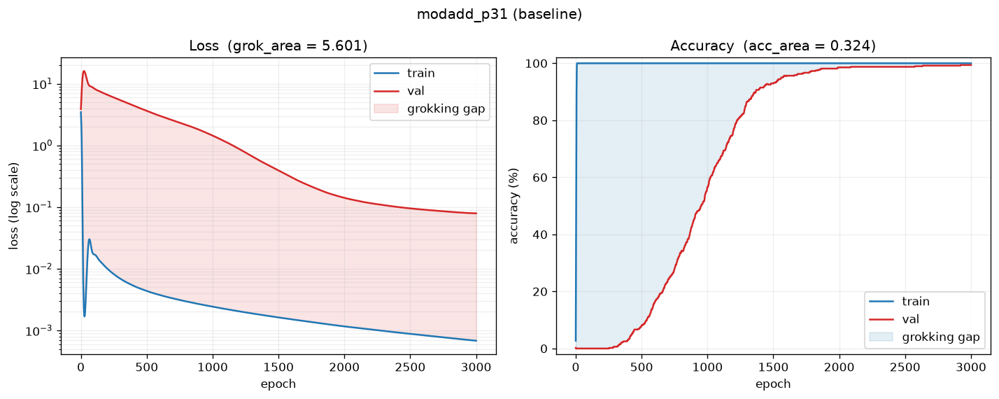

# EvoGrokking

**Evolving neural architectures that generalise *without* grokking.**

Grokking is *delayed generalisation*: a network fits its training set almost
immediately, then continues training for a long time before it suddenly
generalises to held-out data. This project searches — with a **classical NEAT**
evolutionary algorithm — for the MLP topology that generalises *as early as
possible* while still ending up accurate, on datasets whose train/test
distribution shift is what makes grokking happen in the first place.

## What it does

The main parts, one module each:

| Part | Module | Notes |
|------|--------|-------|
| **Grokking measurement + objective** | [`metrics.py`](evogrokking/metrics.py) | log-loss area, bounded accuracy-curve area, `gen_frac`; the **minimise-grokking** score |
| **Datasets** | [`datasets.py`](evogrokking/datasets.py), [`subclasses.py`](evogrokking/subclasses.py) | **distribution-shifted** MNIST/FashionMNIST (Carvalho et al. 2025), plus one-hot `(a+b) mod p` |
| **NN training** | [`train.py`](evogrokking/train.py) | full-batch Adam / AdamW / SGD, CUDA when available, max-iteration cap + grokking-aware early stopping |
| **Architecture evolution** | [`genome.py`](evogrokking/genome.py), [`neat_arch.py`](evogrokking/neat_arch.py), [`models.py`](evogrokking/models.py), [`evolution.py`](evogrokking/evolution.py) | **neat-python** GA with speciation over per-neuron topologies, parallel evaluation |
| **Fixed training recipe** | [`hyperparams.py`](evogrokking/hyperparams.py) | lr / weight decay / dropout / optimizer / init scale — set per run, **not** evolved |
| **Experiment endpoint** | [`experiment.py`](evogrokking/experiment.py), [`plots.py`](evogrokking/plots.py) | `train` / `evolve` / `retrain` CLI + learning-curve and structure plots |

### What evolves — classical NEAT over plain MLPs

A node is **one neuron**; a connection is **one scalar weight** between two
neurons. There are no layers, no convolutions, no embeddings and no width genes.
Node keys follow neat-python's convention:

* **inputs** `-1 .. -n_inputs` — one neuron per input feature (784 for MNIST),
* **outputs** `0 .. n_outputs-1` — one neuron per class logit,
* **hidden** `>= n_outputs`.

What evolves is purely the topology — which neurons exist, how they are wired —
plus each neuron's **activation** gene. Connection weights and biases are found by
**gradient descent**, not evolved: that is what produces the learning curves the
grokking metrics are measured from, so neat-python's `weight`, `bias` and
`response` genes are pinned to constants and never vary.

**The search starts big and dense.** Rather than NEAT's usual minimal seed, the
founding population is a fully connected `inputs → hidden → outputs` MLP (plus
direct `input → output` edges), so the interesting direction is *pruning and
rewiring*: `conn_delete_prob` and `node_delete_prob` default above their `add`
counterparts. `--hidden` sets the size of that starting network.

Two neat-python behaviours had to be corrected for a dense start to work at all:

* **Founding genomes must share their hidden neurons.** `configure_new` normally
  gives each initial genome its *own* hidden-node keys. With `num_hidden > 0` that
  makes the population mutually non-homologous — every genome lands in its own
  species and crossover degenerates into copying, because every gene is disjoint.
  `ArchGenome` overrides it so all founders share one set of keys.
* **The founding activation must be uniform.** Drawing each neuron's activation at
  random makes founders differ on ~¾ of their nodes before evolution starts,
  which alone shatters speciation. Activations diverge by mutation instead.

**Compatibility threshold.** neat-python normalises genomic distance by gene
count, so `--compatibility-threshold` is a *mean per-gene* difference, not a raw
sum — the useful value (default **0.2**) is far below the ~3.0 of textbook
minimal-seed NEAT.

#### How a sparse per-neuron graph still trains fast

Evaluating thousands of individual neurons one at a time would be hopeless, so
[`models.py`](evogrokking/models.py) compiles the genome into a handful of
**masked dense matmuls**: neurons are sorted into topological *levels* (a level
has no edges among its own members, so it computes at once), and each level is one
dense `(prefix, |level|)` matrix times a 0/1 **connectivity mask**. The mask is
applied every forward pass, so gradients flow only along edges the genome actually
has. This is mathematically identical to per-neuron evaluation — there is a test
(`test_masked_dense_matches_per_neuron_evaluation`) asserting agreement to
float precision — but it runs as a few big GEMMs instead of thousands of tiny ones.

**Cost warning.** Classical NEAT gene counts grow with the input dimension, and
neat-python's mutation, crossover and speciation are pure Python over *one object
per gene*. The training itself is fast (a few GEMMs); the **GA bookkeeping**
dominates, and it grows roughly quadratically in the gene count. Measured on this
machine, population 12, one generation, bookkeeping only:

| inputs | `--hidden` | connection genes | s / generation |
|-------:|-----------:|-----------------:|---------------:|
| 62 (`modadd p=31`) | 32 | 2 924 | 0.7 |
| 194 (`modadd p=97`) | 16 | 5 204 | 1.9 |
| 194 | 32 | 8 468 | 4.9 |
| 784 (MNIST) | 8 | 14 192 | 13.5 |
| 784 | 16 | 20 544 | 27.6 |
| 784 | 32 *(default)* | 33 248 | ~70 (extrapolated) |
| 784 | 64 | 58 048 | ~200 (extrapolated) |

So `modadd` is cheap and MNIST is not. On MNIST, budget for the bookkeeping
before raising `--hidden`, and note that `--workers` parallelises the *training*
only — neat-python's own work stays in the parent process.

### The objective: minimise grokking, keep accuracy high

The grokking *scale* is the normalised area between the log-loss curves:

```
grok_area = (1/T) · Σ_t  max(0, log(val_loss_t) − log(train_loss_t))
```

Both losses are clamped into `[1e-8, 1e8]` (and NaN/±inf from diverged runs mapped
into that range) before the log, so neither a perfectly fit split nor a blown-up
run can send the area to ±∞.

The search **minimises** grokking. The trap is that there are two trivial ways to
not grok — *never learn anything* (no gap at all) and *memorise forever* (a
permanent gap) — so the score pays the anti-grokking reward only through a sharp
**accuracy gate** at `--gen-threshold`:

```
gate      = sigmoid(30 · (final_val_acc − gen_threshold))
tightness = 1 − acc_area   # validation tracked training closely
speed     = 1 − gen_frac   # generalisation happened early
score     = acc_weight · final_val_acc
          + gate · (gap_weight · tightness + speed_weight · speed)
```

Below the gate an individual is left with only its (low) final accuracy, so
neither degenerate strategy pays. Above it, credit is proportional to how small
the train/validation gap was (`acc_area`, bounded in `[0, 1]`) and how early
validation accuracy first crossed the threshold (`gen_frac`, `1.0` if it never
did). The three weights are `--acc-weight`, `--gap-weight` and `--speed-weight`
(all default `1.0`).

For hard image subsets that can't reach 90 % val accuracy, lower
`--gen-threshold` accordingly (shifted MNIST at 1 k training images tops out
around 80 %, so `--gen-threshold 0.75` is a reasonable setting).

### The datasets: an induced distribution shift

Following Carvalho et al., *"Grokking Explained: A Statistical Phenomenon"*
(2025), grokking is treated as a consequence of a **train/test distribution
shift**, and MNIST is adapted to induce one on purpose:

1. a small CNN is trained on the full training set; its penultimate layer is the
   **learned feature space** (the paper uses a ResNet — a smaller net is used
   here because the search runs hundreds of trainings, and the result is cached
   per dataset/seed);
2. each digit class is clustered in that space into `--n-subclasses` **latent
   subclasses**;
3. `--shifted-per-class` subclasses of every class are **under-sampled** in the
   *training* set to a fraction `--shift-frac` (`f`) of the rest, following the
   paper's Equation 1:

```
s_s = ⌈ f·γ_D / (f·γ_s + γ_r) ⌉       s_r = ⌊ γ_D / (f·γ_s + γ_r) ⌋
```

The validation split is the untouched test set. Train and test therefore hold the
same digits, in the same class proportions, drawn from **different distributions
over the latent space** — exactly the condition the paper identifies as producing
grokking. `--shift-frac 1.0` removes the shift (a balanced subsample);
`--shift-frac 0.0` drops those subclasses from training entirely.

`--dataset mnist` / `fashionmnist` are the shifted versions; `mnist_plain` /
`fashionmnist_plain` are the classic un-shifted ones.

**Modular addition** has no embedding layer to lean on, so `(a, b)` arrives
**one-hot**: `a` in the first `p` positions, `b` in the next, giving a `2p`-wide
input vector over `p` classes.

### Only the architecture evolves

The training recipe — learning rate, weight decay, dropout, optimizer,
initial-weight scale — is *fixed for the whole run* and shared by every individual
([`hyperparams.py`](evogrokking/hyperparams.py)), so a difference in fitness is
attributable to the topology rather than to a luckier regularisation setting.
Defaults follow the paper (`lr = 1e-3`, `weight_decay = 1e-4`, init scaled by 8);
override with `--lr`, `--weight-decay`, `--dropout`, `--optimizer`,
`--init-scale`. The modular task gets its own defaults, since it needs strong
weight decay to move at all.

### Exploration: making the search actually move

Two properties of a **dense start** work against ordinary NEAT settings, and both
have a knob:

- **Every founder is identical.** `full_direct` wires all founders the same way,
  so generation 0 trains one network `--population` times and selection has
  nothing to choose between (you can see it in the log: `best` equals `mean`
  exactly at gen 0). **`--initial-connection-fraction 0.7`** gives each founder
  its own random 70 % of the wiring, so the population starts genuinely diverse.
  Diverse founders are far apart in genome space, so pair this with a higher
  **`--compatibility-threshold`** or they each become their own species.
- **One gene changes per generation.** neat-python applies each structural
  operator *at most once* per genome per generation. On a minimal seed that is a
  large relative step; on a dense genome of ~28 000 connection genes it is ~0.1 %
  — the search barely moves (again visible in the log: the connection count
  drifts by a few dozen per generation). **`--mutation-rounds 30`** repeats the
  operators 30× per genome, so the step scales with the genome. Activation
  mutation still happens once per genome, so this does not inflate it.

**The accuracy gate can silently switch the objective off.** The anti-grokking
reward is multiplied by a sharp gate at `--gen-threshold` (default 0.90). If no
individual gets near that accuracy, the gate is ~0 and fitness collapses to plain
validation accuracy — the grokking terms contribute nothing, and the "search"
becomes a plain accuracy hill-climb. The run now prints a one-time warning when
this happens; the fix is to lower `--gen-threshold` beneath the accuracy your
runs actually reach, or to train longer with `--epochs`. (On `modadd p=97` at
1 000 epochs, runs sit around 40 % val accuracy, so the default 0.90 gate is shut
— use `--gen-threshold 0.35` or raise `--epochs` well into the thousands.)

If the population splits into more species than `--population` can sustain
(`max(min_species_size, elitism)` genomes per species), the run stops with an
explanation and the three ways to fix it — raise `--compatibility-threshold`,
raise `--population`, or lower `--elitism`.

The generated neat-python config is written to `runs/<name>/neat_config.ini`, so
the exact search settings are recorded with the results.

### Run length: max iterations & early stopping

`--epochs` is the **maximum number of iterations** (a hard cap). Optionally,
training stops early once the run has clearly finished:

* `--target-val-acc 0.95` — stop the moment the target is reached;
* `--patience N` (`--min-delta`) — stop after `N` evaluations with no improvement
  in the *best-so-far* validation loss.

Tracking the best-so-far loss makes patience safe for grokking: the long
pre-grokking plateau doesn't trigger a stop until the loss has actually bottomed
out. Both flags work for `train` and `evolve`; early stopping is off unless one is
set. `--mem-budget-mb` (default 1500) makes the search **skip** genomes whose
estimated footprint exceeds the budget rather than OOM on them; `0` disables it.

### Parallel evaluation

Every fitness evaluation is an independent training run, so the population is
evaluated across worker processes with `--workers N` (a `spawn`-based
`ProcessPoolExecutor`, CUDA-safe; the dataset is shipped to each worker once).
Each genome trains under the run's fixed seed, so the search returns **identical
results regardless of `--workers`** — only faster. Note this parallelises the
*training*, not neat-python's own bookkeeping, which stays in the parent process.

## Install

```bash
uv pip install -e .        # or: pip install -e .
```

Requires PyTorch (CUDA optional but auto-detected), torchvision and neat-python.

## Usage

Train the dense baseline — the same starting network the search begins from — and
report its grokking metrics:

```bash
python main.py train --dataset mnist  --hidden 64 --train-size 1000 --epochs 2000 --plot
python main.py train --dataset modadd --p 31 --hidden 64 --train-frac 0.5 --epochs 4000 --plot
```

Run the evolutionary architecture search:

```bash
python main.py evolve --dataset modadd --p 31 --hidden 32 --generations 12 \
    --population 24 --epochs 1500 --workers 4 --name modadd_search
```

This saves the winning individual to `runs/modadd_search/best.json` (plus the
generation history, the neat-python config, and the dataset settings used).

Reload that best individual, retrain it, and plot its learning curves:

```bash
python main.py retrain --from modadd_search          # reproduces the search run exactly
python main.py retrain --from modadd_search --epochs 8000   # or train it longer
```

**Reproducibility.** A whole run is deterministic from `--seed` (default **123**):
every genome trains under that one fixed seed, and CUDA is put into deterministic
mode. `retrain` reuses the run's saved seed, training recipe, epoch budget and eval
cadence (from `meta.json`) and builds the model *after* seeding, so by default it
reproduces the search phase's best individual **bit-for-bit**. `--epochs N` trains
the winner longer (the shared prefix still matches); `--seed` tries a different
initialisation.

`retrain` rebuilds the exact dataset the search used, writes the trained weights
(`best_model.pt`), the curves (`curves.json` + `curves.png`), and a
**`structure.png`** graph of the evolved network. Because a classical NEAT graph
can have hundreds of neurons and tens of thousands of edges, that plot has two
modes: small graphs are drawn **neuron by neuron** (each labelled with its id and
activation, solid arrows for enabled connections and faint dotted ones for the
disabled genes the genome carries); larger graphs **collapse each topological
level into one box** with its neuron count, and label each arrow with the number
of connections between levels — so the shape of the evolved network stays legible.

On the learning-curve plot's log-loss panel the shaded region between the train
and validation curves *is* the grokking area — which the search works to make
**small**:



`train --plot` produces the same pair of plots for the dense baseline. All commands
write results under `runs/<name>/`.

`python main.py <cmd> --help` lists every knob (population size, objective
weights, the distribution-shift settings, the neat-python speciation parameters,
the fixed training recipe, …).

## Tests

```bash
python -m pytest -q               # everything
python -m pytest tests/test_models.py -q   # one area
```

The suite is split by the module under test:

| File | Covers |
|------|--------|
| `test_metrics.py` | grokking measures and the minimise-grokking objective |
| `test_genome.py` | the per-neuron genome, dense start, structural mutation, fixed recipe |
| `test_models.py` | masked-dense compilation == per-neuron evaluation, level invariants |
| `test_neat_arch.py` | config rendering, shared founding structure, depth growth |
| `test_datasets.py` | one-hot modular task, Equation 1, subclass sampling |
| `test_train.py` | early stopping, seed reproducibility |
| `test_evolution.py` | the search loop, memory budget, per-generation history |
| `test_plots.py` | curve and structure rendering, both plot modes |
| `test_experiment.py` | CLI argument wiring and the artefacts a run writes |

`tests/helpers.py` holds the shared utilities (synthetic curves, the independent
per-neuron reference evaluator, population builders).
